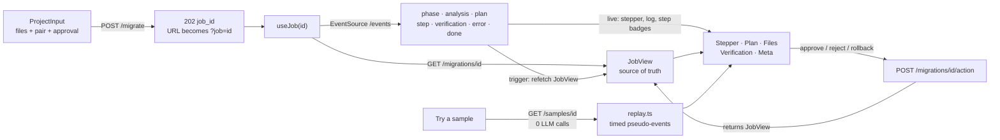

# Frontend Plan — Migration Workflow Agent UI

Frontend design for [PLAN.md](PLAN.md). It consumes the deployed API ([BACKEND_PLAN.md](BACKEND_PLAN.md), [backend/README.md](backend/README.md)), live at https://backend-production-4d1c3.up.railway.app. The stack and quality approach are the same as Labs 1–2. The main differences come from the backend: a job is **long-running and asynchronous** (`202` + SSE), it can **pause for human approval**, and it produces **several files with versions**.

## 1. Scope

| Lab requirement | How it is met |
|---|---|
| Input source code files, select source/target frameworks | **Project editor** with up to 5 files: each has a path and content. Files can be added by typing, pasting, or uploading several at once. The **Source → Target** selectors come from `GET /frameworks`; target options are filtered by the chosen source |
| Real-time progress: Analysis → Planning → Execution → Verification | A **phase stepper** driven by the SSE stream (`GET /migrations/{id}/events`). The current phase shows a spinner and elapsed time. `Awaiting approval` appears between Planning and Execution; the end state is `Completed` / `Failed` / `Cancelled` / `Rolled back`. An **activity log** lists every event as it arrives |
| Migration plan viewer with step status | **Plan viewer**. Each step shows its number, title, description, complexity, `source files → target files`, dependencies ("after 1, 2"), parallel siblings ("runs in parallel with 3"), and a live **status badge** (pending · in progress · completed · failed · skipped · rolled back). It also shows attempts ("retried once") and the error or notes. The plan revision is shown after a replan |
| Output panel with diff view | **Files panel**. It has one tab per migrated file and two modes: **Code** (with line numbers) and **Diff**. Diff compares the file against the source file it came from, or against its previous version. The view is side-by-side on wide screens and unified on phones. Each file can be copied or downloaded |
| Responsive design | Stacked on phones, with the input first and then progress, plan and files. On wide screens there are two columns: input + plan on one side, progress + files on the other. Code and diff blocks scroll inside their own box, never the page |

Extensions, and additions driven by the backend's nature:

| Addition | Why |
|---|---|
| **Approval panel**: "Require approval" is **on** by default. At `awaiting_approval` the UI shows *Approve* and *Reject*. Reject has an optional feedback box: with feedback the plan is re-made once ("1 replan left"), without it the job is cancelled. A countdown shows when the approval expires (30 min after `approval_requested_at`) | Extension: human approval |
| **Parallel steps visible**: steps that can run together are grouped as a "wave", and two steps can show *in progress* at once | Extension: parallel execution |
| **Rollback button** (from `completed` / `failed`), with a confirm dialog. Afterwards the files panel shows the **version history**, with hidden versions struck through | Extension: rollback |
| **Framework pair picker** listing the 4 pairs from the API | Extension: multiple frameworks |
| **Verification panel**: a success banner, confidence `n/10`, each deterministic check (✓/✗ + detail), and Verifier issues with a severity badge **with text** | Shows *why* a migration is trusted |
| **"Try a sample"** loads a sample's files and **replays its stored real job** (animated stepper, plan, files, diff, verification) | A full demo with **0 LLM calls** |
| **Resumable job URL** `/?job=mig_…`: reloading or sharing the page reconnects to the job (GET + SSE with `Last-Event-ID`) | Jobs outlive the page. The approval wait can be long |
| **Meta line**: model, prompt version, real/cached LLM calls, tokens, duration | Makes the agents' work and cost visible |
| **"Download result JSON"**: the lab's JSON (`success`, migrated files, executed plan, verification, errors) | The lab's output contract, one click away |
| **Friendly RFC 9457 errors**, with a **Retry-After countdown** for 429/503 | As in Lab 2 |
| **Privacy notice** | Code is sent to Google Gemini (free tier); don't paste secrets. As in Lab 2 |
| **Client-side input checks** that mirror the backend | Max 5 files, 30,000 characters, relative paths only, extensions per pair, unique paths. *Migrate* is disabled with the reason shown, so no request is wasted |

## 2. Stack

| Tool | Choice |
|---|---|
| Node | 24 (`nvm use 24`) |
| Framework | Next.js 16 (App Router), TypeScript strict, Tailwind v4, same versions as Lab 2 |
| Validation | **Zod**. Every API response **and every SSE event** is parsed with a schema that mirrors the backend. Invalid data is an error; it is never rendered half-valid |
| Live updates | Browser `EventSource`: named events, and automatic reconnect with `Last-Event-ID` built in. No library |
| Diff | **`diff` (jsdiff 9, ships its own types)**: `diffLines` → rows computed in `lib/diff.ts` and rendered by us. No heavy editor component |
| Tests | Vitest + Testing Library (unit, component) · Playwright with the installed Google Chrome (`channel: "chrome"`) + `@axe-core/playwright` |

**Reused from Lab 2, adapted:** the `api.ts` pattern (`request()` + Zod + `ApiError`), the Problem schema, the Retry-After countdown, the severity badge styles, the Vitest / Playwright configs (fake-LLM backend as `webServer`), and the Vercel deploy steps.

## 3. Structure

```
frontend/
├── app/                 layout.tsx · page.tsx (reads ?job=) · globals.css
├── components/
│   ├── MigrationApp.tsx     # top-level client component: input ↔ job, errors, URL sync
│   ├── ProjectInput.tsx     # pair selectors, approval toggle, samples menu, file list, Migrate
│   ├── FileEditor.tsx       # one file: path + monospace textarea + counter + remove
│   ├── PhaseStepper.tsx     # phases with state (done / current / upcoming / failed), timer
│   ├── ActivityLog.tsx      # event list (aria-live), newest last
│   ├── PlanViewer.tsx       # steps, waves, dependencies, status badges, attempts, errors
│   ├── ApprovalPanel.tsx    # approve / reject + feedback, replans left, expiry countdown
│   ├── FilesPanel.tsx       # file tabs, Code | Diff, compare-with selector, copy/download
│   ├── DiffView.tsx         # side-by-side (≥ md) or unified rows, +/− markers, line numbers
│   ├── VerificationPanel.tsx# banner, confidence, checks, issues
│   ├── MetaBar.tsx          # model, calls (real / cached), tokens, duration, JSON download
│   └── ErrorBanner.tsx      # ApiError message, field errors, countdown
├── hooks/
│   ├── useJob.ts            # job state: fetch JobView + subscribe to events + actions
│   └── useCountdown.ts      # Retry-After / approval expiry
├── lib/
│   ├── schemas.ts           # Zod: Framework, Sample, SampleDetail, JobView, Accepted, Problem, events
│   ├── api.ts               # frameworks(), samples(), sample(), migrate(), job(), approve(), reject(), rollback()
│   ├── events.ts            # subscribe(jobId, handlers): EventSource wrapper, Zod per event, poll fallback
│   ├── diff.ts              # lineDiff(a, b) → rows; sideBySide(rows); stats (+n / −n)
│   ├── files.ts             # client-side validation (mirrors backend), upload → {path, content}
│   ├── phases.ts            # phase order, labels, terminal set, status styles
│   ├── plan.ts              # waves (parallel groups) from depends_on
│   └── replay.ts            # sample replay timeline (JobView → timed pseudo-events)
├── tests/               unit + component (Vitest)
└── e2e/                 Playwright
```

## 4. Data flow and state



- **The JobView is the source of truth; events are live hints.**
  - An event updates the stepper, the activity log and the step badges immediately.
  - `plan`, `step` (completed / failed), `verification` and `done` events also trigger a **debounced refetch** of `GET /migrations/{id}` (300 ms). That refetch brings the files, versions and meta.
  - This costs 0 LLM calls, and the UI can never drift from the stored state.
- **`done` closes the stream.** The final JobView is fetched once more.
- **Reconnects.**
  - `EventSource` reconnects on its own and sends `Last-Event-ID`; the backend replays only newer events.
  - If the stream is closed for good (for example a proxy error), `events.ts` falls back to **polling** the JobView every 3 s until a terminal phase. A notice says "Live updates interrupted — refreshing every few seconds".
- **URL sync.**
  - `?job=` is set with `history.replaceState` once the job is accepted.
  - Opening `/?job=mig_…` loads that job.
  - A `404 job-not-found` there shows "This migration no longer exists" and a *New migration* button.
- **Actions** (`approve`, `reject`, `rollback`) return the JobView, which is applied at once.
  - A `409 invalid-transition` refetches the job and shows "The migration already moved on". The usual cause is an approval that expired or another tab acting first.
- **Replays of samples.**
  - `replay.ts` turns a stored JobView into timed pseudo-events: phases about 600 ms apart, steps one by one, then verification.
  - The same components render it.
  - A badge says "Stored result — replay (0 LLM calls)".
  - The *Approve* / *Rollback* buttons are hidden, because a sample isn't a server job.
  - "Run it for real" submits the sample's files as a new job.

## 5. Diff view

Mapping a migrated file to "what it replaced" is not 1:1: `app.py` becomes `main.py`, and Django's `views.py` + `urls.py` become one `main.py`. The **Compare with** selector offers:

| Option | Left side | Default when |
|---|---|---|
| Source file, same path | Source file of the same path (e.g. `models.py`, `report.py`) | That path exists in the sources |
| Source files of the writing step | Each file in the step's `source_files` (choose one; the default is the first) | The path is new (e.g. `main.py`) |
| Previous version | Version *n − 1* of the same path (from `?include_history=true`) | Only offered when a file has several versions (retries, rollback history) |

- Rows show old and new line numbers and a `+` / `−` / space **marker**, so the change is not shown by color alone. Unchanged runs longer than 8 lines fold into "⋯ 23 unchanged lines" (click to expand).
- **Stats** appear in the tab: `+42 −17`.
- **Side-by-side** at `md` and wider, **unified** below. A toggle is available on wide screens.
- **Rendering.** Plain `<pre>` rows, with no syntax highlighting (bundle size and focus). Up to 30,000 characters per job means a few hundred rows at most, so there is no virtualization.

## 6. API client and errors

- `NEXT_PUBLIC_API_URL` is set at build time; the default is `http://localhost:8000`.
- Request timeout is **30 s**. Every call returns quickly now: `POST /migrate` answers `202` immediately and the work streams over SSE.
- Errors become `ApiError { kind, message, retryAfter?, fieldErrors? }`:

| Response | `kind` | Shown to the user |
|---|---|---|
| 400 `malformed-request` / 422 `validation-error` | `validation` | Each field error, with pointers mapped to labels (`#/files/1/content` → "File 2 content: must not be empty", `#/files` → the detail) |
| 422 `unsupported-migration` | `unsupported` | Problem `detail` (lists the supported pairs) |
| 413 `input-too-large` | `too_large` | Problem `detail` (states the limit) |
| 404 `job-not-found` | `not_found` | "This migration no longer exists" + *New migration* |
| 409 `invalid-transition` | `conflict` | "The migration already moved on" + refetch |
| 429 `rate-limited` | `rate_limited` | "You started too many migrations — try again in N s" + countdown; *Migrate* disabled |
| 503 `llm-quota-exhausted` | `quota` | "Today's free AI quota is used up — samples still work" + countdown (can be hours: shown as "about 5 h") |
| 503 `llm-unavailable` | `busy` | "The service is busy with other migrations" + countdown |
| Other non-2xx | `server` | Generic message |
| `fetch` throws / timeout | `network` / `timeout` | "Can't reach the migration service" / "took too long" |
| Body or event fails its Zod schema | `invalid_response` | "Unexpected response from the server" |

A **failure inside the job** is not an `ApiError`. The job ends in `failed` with `errors[]`; the stepper marks the failing phase and the errors are listed in the verification area. Examples are a bad plan, the per-job budget being reached, or the quota running out mid-job.

## 7. Accessibility and UX details

- **Stepper.** An ordered list with `aria-current="step"` on the current phase. Phase changes are announced by a polite `aria-live` region, one sentence per change ("Planning finished — waiting for your approval").
- **Status badges and severity badges** always carry **text**, never color alone. Colors meet contrast AA; Lab 2's lesson was orange-700 and zinc-600 on white.
- **Tabs** (files, Code/Diff) follow the WAI-ARIA tabs pattern: `role="tablist"`, arrow keys, `aria-selected`.
- **Busy states.**
  - While `POST /migrate` is in flight, *Migrate* is disabled and has `aria-busy`.
  - During a running job the input is read-only, with a *New migration* button.
- **Dialogs.**
  - Rollback asks for confirmation ("Hide all generated files? The history is kept.") in a native `<dialog>`.
  - Reject shows a feedback textarea (max 2,000 characters, with a counter).
- **Mobile at 375 px.** No horizontal page scroll; code, diff and the plan's file lists scroll inside their boxes; every control is reachable.

## 8. Quality strategy

| Level | What | Real LLM calls |
|---|---|---|
| Unit | `api.ts` (every row of §6, request shapes, Zod rejection), `events.ts` (event parsing, `done` closes the stream, invalid event, poll fallback), `diff.ts`, `files.ts`, `plan.ts` (waves), `replay.ts`, `phases.ts` | 0 (fetch and EventSource faked) |
| Component | `MigrationApp` behaviors C1–C14 below | 0 (api and events mocked) |
| E2E local | Real backend with **`LLM_MODE=fake`** + real frontend: the whole flow through real SSE, including approval | **0** |
| E2E production | Samples replay (free), mobile, a11y, and **one** real migration of the `flask_todo` sample | **0 expected**: the same prompts were answered during the post-deploy check (V5), so the server's response cache replies. At most ~6 if the cache missed |
| Also | `tsc`, ESLint, `next build`, coverage ≥ 80 % | 0 |

**Component tests**

| ID | Test |
|---|---|
| C1 | Initial render: pair selectors filled from `/frameworks`, one empty file, approval toggle on, privacy notice; *Migrate* disabled with its reason |
| C2 | Choosing *Express* limits targets to FastAPI and file extensions to `.js/.mjs/.cjs/.ts`; a `.py` file shows an inline error |
| C3 | Limits: a 6th file cannot be added; > 30,000 characters or duplicate/absolute/`..` paths disable *Migrate* and explain why |
| C4 | Multi-file upload fills paths and contents; an unsupported extension is refused with a message |
| C5 | *Migrate* sends `{files, source_framework, target_framework, require_approval}`, sets `?job=`, and shows the stepper at Analysis; double submit is blocked |
| C6 | Events move the stepper (analysis → planning → awaiting approval), fill the activity log, and show the plan with pending badges |
| C7 | Approval panel: *Approve* calls `approve` and the steps turn in progress → completed from events; two steps of one wave can be in progress at once |
| C8 | Reject with feedback calls `reject` with it, shows "Plan revision 2"; the second time "no replans left" and reject → cancelled |
| C9 | Completed: success banner, confidence, checks, issues with severity text; file tabs with `+/−` stats; Code ↔ Diff; compare-with options follow §5 |
| C10 | Failed step: its error is shown, dependents are *skipped*, the job errors are listed, and *Rollback* is offered |
| C11 | Rollback: confirm dialog → `rollback` → phase *Rolled back*, no current files, history shows hidden versions |
| C12 | Sample: files and pair are loaded and the replay animates to the stored result (fake timers) **without** calling `migrate`; "Run it for real" submits it |
| C13 | Errors: 422 field errors per file, 429 and 503 countdowns disable *Migrate* until 0 (fake timers), 409 refetches, 404 on `?job=` shows the "no longer exists" state |
| C14 | Stream lost → poll fallback notice, JobView polled until terminal; the final state still renders |

**E2E** (Playwright; the fake-LLM backend finishes a job in under 1 s, so the approval pause is the only wait)

| ID | Test |
|---|---|
| E1 | `flask_todo` files pasted, approval **off** → stepper reaches Completed through real SSE → plan all completed → `main.py` diff renders |
| E2 | Approval **on** → pauses at *Awaiting approval* → reject with feedback → revision 2 → approve → Completed |
| E3 | Rollback of a completed job → Rolled back; reload with `?job=` restores the same view (resume) |
| E4 | Each of the 4 samples replays its stored result (0 calls) |
| E5 | Errors: unsupported extension blocked client-side; backend down (`page.route` abort) → network message; 429 with `Retry-After` (route mocked) → countdown |
| E6 | Mobile 375×667: no horizontal scroll across input, stepper, plan and diff; all controls reachable |
| E7 | Accessibility: axe finds no serious/critical violations on the input, the approval state and the completed state |
| E8 | Production: E4 + E6 + E7 + one real `flask_todo` migration with approval against the live URLs |

## 9. Deployment (Vercel)

Same steps as Labs 1–2 ([Lab 2 frontend/DEPLOY.md](https://github.com/RodrigoDamasio/TA_Module2/blob/main/Lab_module2/frontend/DEPLOY.md)):

```bash
cd TA_Module3/Lab_module3/frontend
vercel link --yes --project taller-migration-agent
printf 'https://backend-production-4d1c3.up.railway.app' | vercel env add NEXT_PUBLIC_API_URL production
vercel --prod --yes
# then, from ../backend (redeploys the API with the new CORS origin):
railway variables --set "FRONTEND_ORIGIN=http://localhost:3000,https://<vercel-domain>"
```

**Post-deploy checks:**
- The page is public (200), and the bundle contains the Railway URL.
- CORS works from the Vercel origin: preflight, error responses, and the **SSE stream** (Railway must not buffer it; this was already verified in backend V4).
- E8.

Vercel needs no new secret: the Gemini key stays on Railway only.

## 10. Implementation order

| # | Step | LLM calls |
|---|---|---|
| 1 | Scaffold (Next 16, Tailwind, Vitest, Playwright, ESLint) from Lab 2; `lib/schemas.ts` + `api.ts` + unit tests | 0 |
| 2 | `files.ts`, `ProjectInput`, `FileEditor`, pair selectors, samples menu (C1–C5) | 0 |
| 3 | `events.ts`, `useJob`, `PhaseStepper`, `ActivityLog`, `PlanViewer` + `plan.ts` (C6) | 0 |
| 4 | `ApprovalPanel`, rollback, `VerificationPanel`, `MetaBar` (C7, C8, C10, C11) | 0 |
| 5 | `diff.ts`, `DiffView`, `FilesPanel` (C9) | 0 |
| 6 | `replay.ts` + errors + resume + fallback (C12–C14); responsive and a11y pass | 0 |
| 7 | E2E E1–E7 against the fake-LLM backend | 0 |
| 8 | Deploy to Vercel, CORS on Railway, E8, `DEPLOY.md`, README | 0 (≤ 6) |

## 11. Definition of done

- [x] Every lab frontend requirement (§1), including the 4 extensions visible in the UI
- [x] typecheck, lint, 53 unit/component tests (~95 % lines), build: 0 LLM calls
- [x] E1–E7 (+ E7b) pass locally against the fake-LLM backend: 11/11
- [x] Deployed to Vercel (https://taller-migration-agent.vercel.app); CORS updated on Railway; production subset 7/7, incl. E8
- [x] `frontend/DEPLOY.md` with the steps run; `frontend/README.md`; plans updated (§12)

## 12. Implementation notes (deviations from this plan)

| Plan | Implementation | Why |
|---|---|---|
| Rollback confirm in a native `<dialog>` | Inline confirmation ("Hide all generated files? The history is kept." + *Confirm rollback* / *Cancel*) | Same accessibility, simpler, testable in jsdom |
| Two columns: input + plan / progress + files | Top row: **input │ progress** (stepper, log, approval, meta). Below, full width: **plan, verification, files** | The side-by-side diff needs the full width |
| Extra modules | `lib/compare.ts` (Compare-with options, §5), `lib/download.ts`, `hooks/useReplay.ts` | Kept components small and testable |
| E2E starts `npm run dev` | E2E builds and runs the **production** app (`next build && next start`) | The dev server hit the OS file-watch limit on this machine. A production build is also closer to Vercel |
| — | `turbopack.root` set in `next.config.ts` | A stray `package-lock.json` in the home folder was being picked as the workspace root |
| `vite-tsconfig-paths` (Lab 2) | Vite's native `resolve.tsconfigPaths` | The plugin is now redundant (Vite deprecation notice) |
| Untouched empty file flagged as an error | Blank files are not flagged individually; the *Migrate* hint explains ("Add at least one file…") | Better first impression. Nothing is red before the user types |
| E8 expected 0 calls (server cache) | **4 real + 2 cached** | The planner's prompt includes the episode recorded by the backend's V5 run (episodic memory), so only the analysis was a cache hit |

**Bugs found by the tests and fixed:**
- **Duplicate form ids after hydration (E2E).** The server and the browser each had their own module counter. Fixed with `useId`.
- **Accessible name "Removefile 2" (component test).** Fixed with an explicit `aria-label`.
- **Countdown measured from mount (component test).** Fixed so it counts from when the error arrived.
- **Scrollable diff/code/activity regions not keyboard-focusable (axe).** Fixed with `tabIndex=0` and labelled regions.
