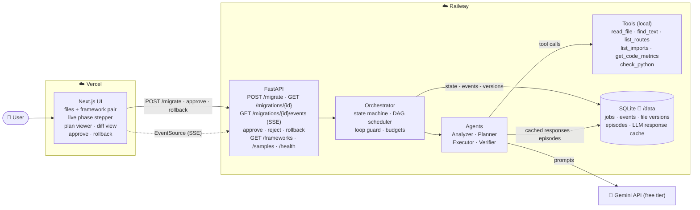
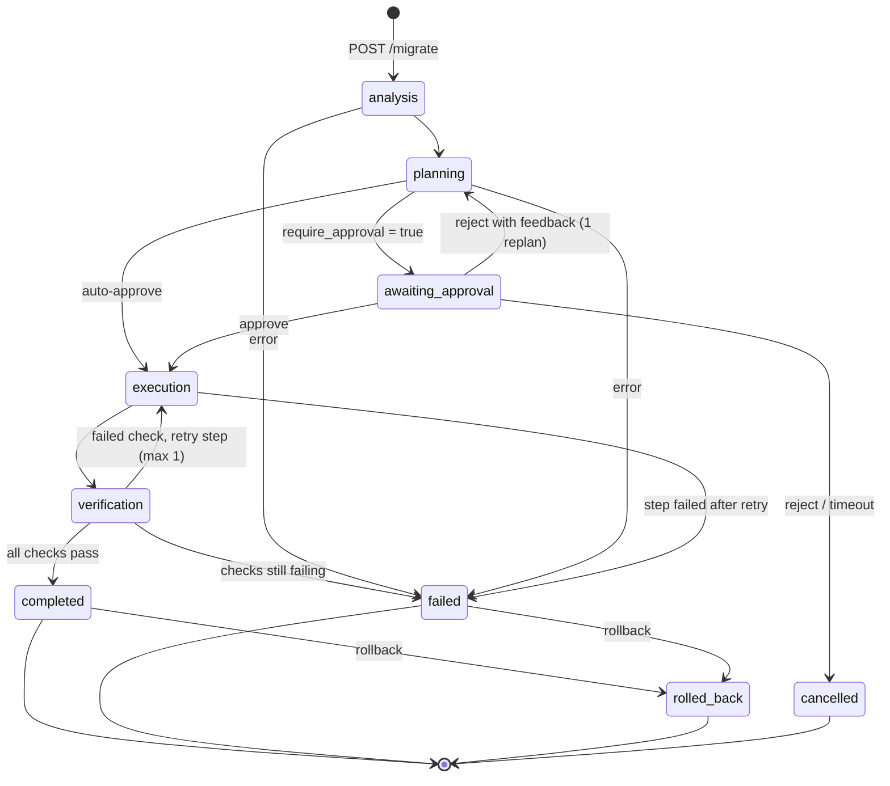
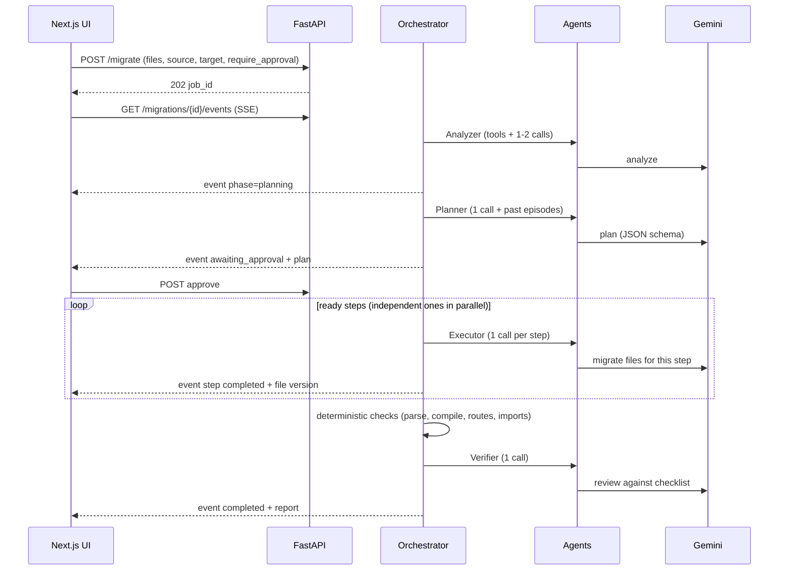

# Lab 3 — Big Picture Plan: Migration Workflow Agent

Solution-level plan for [Lab3_Migration_Workflow_Agent.md](Lab3_Migration_Workflow_Agent.md), **including all four extension challenges**. Detailed designs come later in `BACKEND_PLAN.md` and `FRONTEND_PLAN.md`.

Built on the Module 3 course material (Planning, Verification, Pipeline, and memory patterns) and on the standards and code of Labs 1 and 2.

## 1. What we are building

A web app where a user submits one or more source files, picks a **migration** (e.g. *Flask → FastAPI*), and watches an agent work through four phases in real time:

1. **Analysis** — understand the code: files, routes, dependencies, risky patterns.
2. **Planning** — produce a step-by-step plan with dependencies and complexity; the user **approves or rejects** it.
3. **Execution** — run the steps (independent steps **in parallel**), generating the migrated files.
4. **Verification** — check the migrated code **deterministically** (it parses, compiles, keeps every route, no source-framework imports remain) and with an LLM reviewer; retry a failed step once.

Output: migrated files with a **diff view**, the executed plan with each step's status, a verification report, and errors — plus **rollback** of a failed or unwanted migration.

## 2. Key decisions

| Decision | Choice | Why |
|---|---|---|
| Language | **Python 3.12 · FastAPI · dataclasses** (state) + Pydantic (LLM output / API) | Lab's "Python" column; same stack as Labs 1–2 |
| Frontend | Next.js 16 · TypeScript · Tailwind · Zod | Same as Labs 1–2 |
| Agent pattern | **Hybrid** — Planning pattern for the whole job, ReAct (tools) inside analysis and each step, Verification pattern at the end | Course §3.4 + Exercise 1 ("plan first, use ReAct for each step") |
| Multi-agent shape | **Pipeline** — four specialized agents (Analyzer, Planner, Executor, Verifier), each with its own persona and structured output, run by an **Orchestrator** that owns the state machine | Course §5.2 Pipeline pattern; the four phases map 1:1 |
| Framework | **Custom** (no LangChain/CrewAI) | Course §6.4: "learning how agents work, full control, minimal dependencies"; reuses Lab 2's LLM layer |
| LLM | Google Gemini free tier, `gemini-3.5-flash-lite` via Lab 2's adapter | Only working key; `gemini-3.8-flash` = 20 requests/day (found in Lab 2) |
| Migrations supported | **4 pairs, all with a Python target:** Flask → FastAPI · Express.js → FastAPI · Django views → FastAPI · Python 2 → Python 3 | Extension *Multiple Frameworks*; a Python target lets verification **parse and compile** the output deterministically, without running it |
| Job model | **Asynchronous jobs** persisted in SQLite: `POST /migrate` → `202` + job id; progress over **Server-Sent Events** | Real-time progress, human approval pauses, and rollback all need a job that outlives one HTTP request |
| Generated code | **Never executed** on the server | It is model output driven by user input — running it would be remote code execution. Verification is static (§8) |

## 3. Architecture



### Job state machine



### One migration, end to end



## 4. Agents and prompts

Each agent = persona prompt (Module 2 RCFG style, versioned prompt files) + tools + a Pydantic output schema (lenient twin sent to Gemini, strict model validated locally — Lab 2).

| Agent | Input | Tools | Output (validated) | LLM calls |
|---|---|---|---|---|
| **Analyzer** | Source files (numbered) + deterministic facts (routes, imports, metrics) | `read_file`, `find_text`, `list_routes`, `list_imports`, `get_code_metrics` | `Analysis`: summary, components, dependencies, framework patterns found, risks | 1–2 |
| **Planner** | Analysis + target framework guide + **past episodes** for this pair | — | `Plan`: steps `{id, title, description, depends_on[], complexity, source_files[], target_files[]}` (≤ 8 steps) | 1 (+1 repair) |
| **Executor** | One step + only the files it touches + analysis summary (working memory) | `read_file`, `find_text`, `check_python` | `StepResult`: files `{path, content}`, notes | 1 per step |
| **Verifier** | Deterministic check results + migrated files + plan | `check_python`, `list_routes` | `VerificationReport`: checks, issues `{severity, file, line, message}`, confidence 1–10, verdict | 1 |

**Deterministic facts first, LLM second** (quota and reliability): routes and imports are extracted with the Python AST (Flask/Django/Py2 sources) and pattern matching (Express), so the agents start from facts instead of re-deriving them.

**Framework guides** (context injection, Module 2): one short file per pair mapping source idioms to target idioms (e.g. `@app.route` → `@app.get`, `request.get_json()` → Pydantic body, `jsonify` → return dict, `abort(404)` → `HTTPException`).

## 5. State, memory, and context (Module 3 §1)

| Course memory type | In this app |
|---|---|
| **Working memory** | The `MigrationJob` aggregate (dataclasses): phase, analysis, plan with step states, file versions, events, errors, budgets — persisted after **every** transition |
| **Short-term** | Each agent call's own conversation (tool rounds), discarded after the phase |
| **Episodic** | `episodes` table: one record per finished migration (pair, outcome, steps, errors, a one-line *learning*); the Planner receives the 3 most recent for the same pair — course §1.5 "EpisodicMemory" |
| **Long-term** | `MemoryStore` port only (no vector DB now) — the hook where **Module 4 adds RAG** to this agent |

**Context management** (per step, not per job): an Executor call sees only its step, the files in `source_files`/`target_files`, and a compact analysis summary — never the whole history (course "selective retention"). Lab 2's token budget, numbered lines, and tool-result trimming are reused.

**Loop guard** (course §5.4): hard caps — ≤ 8 plan steps, ≤ 2 tool rounds per call, 1 replan, 1 retry per failed step, total **LLM-call budget per job** (e.g. 16); exceeding any cap ends the job with a clear error instead of looping.

## 6. Extension challenges

| Extension | Design |
|---|---|
| **Human approval** | `require_approval` (default **on** in the UI). After planning, the job pauses in `awaiting_approval`; `POST …/approve` or `POST …/reject` (optional feedback → one replan). Pending approvals expire after 30 min. API callers can set `require_approval=false` (and `?wait=true` for a synchronous response in the lab's JSON shape) |
| **Parallel execution** | The plan is a DAG; the scheduler runs every step whose dependencies are completed, up to `PARALLEL_STEPS` (default 2) at once, via a thread pool. Cycles are rejected at planning time. Note: on the free tier Gemini calls stay **serialized** by the Lab 2 concurrency gate, so parallelism saves the non-LLM time and demonstrates the scheduling; with a paid key the gate can be raised |
| **Rollback** | Every file write is a new **version** (`file_versions`, append-only). Rollback restores the pre-migration state (or the state before a failed step) and marks affected steps `rolled_back`; it is a data operation — nothing on disk or in any real repo is touched |
| **Multiple frameworks** | A `FrameworkPair` registry (4 pairs, §2): each entry = source parser, target checker, framework guide, sample. Adding a pair = adding one entry + guide + sample |

## 7. API contract (summary)

| Method · Path | Purpose | LLM calls |
|---|---|---|
| `POST /migrate` | Body `{files: [{path, content}], source_framework, target_framework, require_approval?}` → `202 {job_id, status_url, events_url}`; `?wait=true&require_approval=false` → `200` final result | 0 at request time |
| `GET /migrations/{id}` | Full state — **the lab's JSON**: `success`, `migrated_files`, `plan` (steps + statuses), `verification`, `errors`, plus `phase`, `analysis`, `meta` (calls, tokens, cached) | 0 |
| `GET /migrations/{id}/events` | SSE stream: `phase`, `step`, `plan`, `awaiting_approval`, `verification`, `done`, `error` (+ keep-alive) | 0 |
| `POST /migrations/{id}/approve` · `/reject` | Human-in-the-loop | 0 / ~1 (replan) |
| `POST /migrations/{id}/rollback` | Restore original files | 0 |
| `GET /frameworks` | Supported pairs with descriptions | 0 |
| `GET /samples` · `GET /samples/{id}` | Demo sources + a **stored completed job** (replayable in the UI) | 0 |
| `GET /health` · `GET /problems/{slug}` | As Lab 2 | 0 |

Errors: RFC 9457 (Lab 1/2 module) — `400`, `404 job-not-found`, `409 invalid-transition` (e.g. approve a running job), `413 input-too-large`, `422 validation-error`, `422 unsupported-migration`, `429 rate-limited`, `503 llm-quota-exhausted`/`llm-unavailable` + `Retry-After`. Failures *inside* a job are recorded in the job (`errors[]`, `phase=failed`), not as HTTP errors.

**Input limits:** ≤ 5 files, ≤ 30,000 characters total, paths validated (relative, no `..`).

## 8. Verification (what "compiles/runs" means here)

| Check | How | LLM |
|---|---|---|
| **Parses** | `ast.parse` on every migrated `.py` file | no |
| **Compiles** | `compile(source, path, "exec")` — bytecode only, never executed | no |
| **Lint errors** | Undefined names, unused imports via Ruff (`F` rules) on a temp copy | no |
| **Framework migrated** | No imports of the source framework remain (`flask`, `django`, `express` idioms, Py2 modules); target framework imported | no |
| **Routes preserved** (web pairs) | Every source route (method + path) exists in the target (AST route extraction on both sides) | no |
| **Semantic review** | Verifier agent: checklist + confidence 1–10 (course §3.3); `< 7` → issues listed | 1 call |

If a deterministic check fails, the step that produced the file gets **one retry** with the check output as feedback (course "retry with validation feedback"). Running the migrated app or its tests is **not** done in production (§2); an optional, off-by-default local mode may be considered later behind a sandbox.

## 9. Reuse from Labs 1 and 2

Each lab is its own repository, so reused code is **copied and adapted**, not shared as a package.

| From | What | How |
|---|---|---|
| Lab 1 | Layered architecture (domain / application / infrastructure / api) + architecture tests | Same layout and tests |
| Lab 1 / 2 | RFC 9457 `problems.py`, CORS with error middleware inside CORS, Ruff `S` rules, parameterized SQL only | Copy; add migration problem types |
| Lab 2 | `LLMClient` port, `GeminiClient` adapter (tool calls, schema output, quota parsing, SDK retries off) | Copy as-is |
| Lab 2 | Quota decorators: pacing, retry (minute quota / overload), circuit breaker (daily quota until midnight PT), concurrency gate | Copy as-is; add a **CachingLLMClient** (identical request → stored response, 0 calls) |
| Lab 2 | Prompt library loader (`fill`, versioned files), lenient/strict schema twins, repair-once validation | Copy; new prompt files per agent |
| Lab 2 | Tools `read_lines`/`find_text`/`get_code_metrics` (lizard), result trimming | Adapt to multiple files |
| Lab 2 | `RateLimiter`, SQLite cache, `SampleStore`, `LLM_MODE=fake` demo client, fake LLM + recorded cassettes, evaluation harness (cached, resumable, `--max-calls`) | Adapt |
| Lab 2 | Frontend: Zod-validated `api.ts` with RFC 9457 mapping + Retry-After countdown, severity styles, Vitest setup, Playwright on installed Chrome, `LLM_MODE=fake` E2E backend | Adapt |
| Lab 1 / 2 | `DEPLOY.md` pattern, Railway (volume, key via `--stdin`), Vercel (build-time API URL), post-deploy checks | Follow |

## 10. Free-tier strategy

| Activity | Real Gemini calls |
|---|---|
| Regular backend/frontend test suites (every change) | **0** — fake LLM, recorded cassettes, `LLM_MODE=fake` E2E |
| One migration (typical) | **~8–12**: analysis 1–2 · plan 1 · ~4–6 steps · verification 1 · ≤ 1 retry |
| Hard cap per job | **16** calls (loop guard) |
| Re-running an identical migration | **0** — CachingLLMClient returns stored responses |
| Recording adapter cassettes | ~3, once |
| Evaluation smoke (1 pair) | ~10 first time, 0 cached |
| Evaluation full (4 pairs) | ~45 first time, 0 cached; resumable, `--max-calls` |
| Post-deploy checks | ~0–12 (samples are free; at most one real migration) |
| Demo in the UI | **0** — samples replay stored completed jobs with animated progress |

Production protections: per-IP rate limit on **new jobs** (e.g. 2/min, 10/day), one job running at a time (queue), daily circuit breaker, input limits, job LLM budget.

## 11. Test strategy (overview)

| Layer | Calls | Checks |
|---|---|---|
| Unit | 0 | State machine transitions (valid/invalid), DAG validation (cycles, unknown deps) and scheduling order, parallel levels, budgets/loop guard, rollback restores exact versions, schemas |
| Parsers / checkers | 0 | Route and import extraction per source framework; verification checks on known-good and known-bad files |
| Agents (fake LLM) | 0 | Each agent's prompt shape, tool use, repair, step retry with feedback, replan on reject |
| Orchestrator (fake LLM) | 0 | Full job to `completed`, approval pause, reject → replan, failure → `failed`, rollback, parallel run, restart recovery |
| API | 0 | `POST /migrate` 202/200, SSE event sequence, approve/reject/rollback transitions + `409`, RFC 9457, rate limit, CORS |
| Adapter (cassettes) | 0 (~3 once) | Gemini mapping for the new schemas |
| **Evaluation** (opt-in) | smoke ~10 · full ~45, cached | Per sample: completes, all migrated files parse/compile, all routes preserved, no source-framework imports, verifier confidence — scored **deterministically**, no LLM judge |
| Frontend unit/component/E2E | 0 | Stepper, plan viewer statuses, approval flow, diff view, rollback, errors, responsive, accessibility |
| Post-deploy | 0–12 | Health, samples, one migration end to end (optional) |

### Sample corpus (`backend/samples/`)

| Sample | Pair | Contents | Expected |
|---|---|---|---|
| `flask_todo/` | Flask → FastAPI | `app.py` (5 routes, `jsonify`, `abort`, `request.get_json`) + `models.py` | 5 routes preserved; no `flask` import |
| `express_users/` | Express → FastAPI | `app.js` + `routes/users.js` (course §6.5 style: register/login/me) | Routes preserved; Pydantic models; `HTTPException` |
| `django_articles/` | Django views → FastAPI | `views.py` + `urls.py` (function views, `JsonResponse`) | Routes from `urls.py` preserved |
| `py2_report/` | Python 2 → Python 3 | `print` statements, `iteritems`, `except X, e`, `urllib2`, `unicode` | Compiles on Python 3; no Py2 idioms left |

## 12. Security

- Generated code is **never executed**; verification is parse/compile/lint/AST only (§8).
- Input: path validation (no absolute paths, no `..`), size and file-count limits; source code is untrusted — "code is data" rule in every prompt (Lab 2), prompt-injection sample in the evaluation.
- LLM output: strict schema validation; migrated file paths re-validated (Executor cannot write outside the job's virtual workspace — files live in the DB, not on disk).
- Carry-over: RFC 9457, CORS (error middleware inside CORS), Ruff `S` rules, SQL only in infrastructure with bound parameters, API key via `--stdin`, logs without code or key.
- Privacy notice in the UI (Gemini free tier) — as Lab 2.

## 13. Target structure

```
Lab_module3/
├── Lab3_Migration_Workflow_Agent.md
├── PLAN.md                 ← this file
├── BACKEND_PLAN.md         ← next
├── FRONTEND_PLAN.md        ← next
├── backend/                → Railway
│   ├── app/
│   │   ├── domain/         # MigrationJob, Plan, PlanStep, FileVersion, events (dataclasses); errors; ports
│   │   ├── application/    # Orchestrator, agents, scheduler, verification, rollback, prompts
│   │   ├── frameworks/     # FrameworkPair registry: parsers, checkers, guides
│   │   ├── tools/          # agent tools
│   │   ├── prompts/        # per-agent prompt files + framework guides
│   │   ├── infrastructure/ # Gemini adapter + decorators (from Lab 2), SQLite job store, cache
│   │   └── api/            # routes, SSE, problems, guards, wiring
│   ├── samples/  eval/  tests/
│   └── DEPLOY.md
└── frontend/               → Vercel
    ├── app/ components/ lib/
    ├── tests/ e2e/
    └── DEPLOY.md
```

## 14. Phases

| # | Phase | Real calls | Output |
|---|---|---|---|
| 0 | Copy Lab 2 foundations (LLM layer, decorators, problems, guards, test fakes); scaffold | 0 | Green skeleton |
| 1 | Domain + state machine + DAG scheduler + rollback (dataclasses) | 0 | Unit-tested core |
| 2 | Framework registry: parsers, deterministic checkers, guides, samples | 0 | Verification without LLM |
| 3 | Agents + prompts + Orchestrator with fake LLM (incl. approval, parallel, retry, replan) | 0 | Full job lifecycle, 0 quota |
| 4 | API: jobs, SSE, approve/reject/rollback, RFC 9457, rate limit, samples | 0 | End-to-end with `LLM_MODE=fake` |
| 5 | Real Gemini: cassettes, first real migration, evaluation smoke → full; publish demo jobs | ~3 + ~10 + ~45 | Scored evaluation report |
| 6 | Frontend: stepper, plan viewer, approval, diff view, rollback, samples | 0 | Local app |
| 7 | Deploy Railway + Vercel; post-deploy checks; E2E on production | 0–12 | Live URLs |

### Deliverables → phases

| Deliverable | Phase |
|---|---|
| Migration agent with all 4 phases | 3, 5 |
| Proper state management | 1 |
| Plan creation and execution | 1, 3 |
| Verification step | 2, 3 |
| Deployed to Railway/Vercel | 7 |
| Web frontend with workflow visualization | 6 |
| Application URL | 7 |
| Extensions: rollback · parallel · human approval · multiple frameworks | 1 · 1, 3 · 3, 4, 6 · 2 |

## 15. External tasks (you)

- Nothing new: Railway/Vercel CLIs are logged in, `GOOGLE_API_KEY` works, GitHub repo exists.
- Approve, at deploy time, putting the key on the new Railway project (as Lab 2).

## 16. Risks

| Risk | Mitigation |
|---|---|
| `flash-lite` generates weaker code than larger models | Deterministic checks + one retry with feedback; small, focused steps; evaluation measures it; model configurable |
| Free-tier daily limit reached mid-job | Job budget + circuit breaker; job ends `failed` with "quota" reason and can be retried later from cache (completed calls cost 0) |
| Long-running jobs vs. HTTP | Async jobs + SSE with keep-alives; state in SQLite; on restart, running jobs are marked `failed (interrupted)` |
| Parallel steps editing the same file | Planner must not give two independent steps the same `target_files`; scheduler rejects such plans (they must be ordered by a dependency) |
| Cross-language diff (JS → Python) is not line-comparable | Diff view shows side-by-side source/target for cross-language pairs and a true line diff between versions of the same target file |
| Prompt injection in submitted code | "Code is data" rule, strict schemas, never executing output, dedicated sample |
| Lab time (1h45) | Core path first (phases 1–4 with fake LLM → 5 → 6 → 7); extensions are designed in from the start, so they are thin additions |
